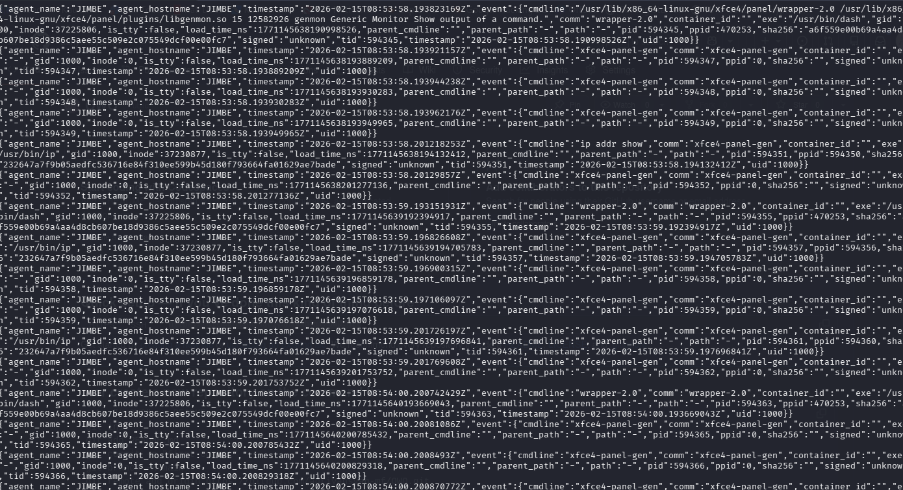

# Open Workstation Observer (OWO)




> **Lightweight, eBPF-powered endpoint visibility for Linux. Exec, file, and network events as JSON—your SIEM does the rest.**

**Current version:** [v0.1.0](https://github.com/adriyansyah-mf/OWO/releases) · [Releases](https://github.com/adriyansyah-mf/OWO/releases)

**Open Workstation Observer** (OWO) is an eBPF-based endpoint monitoring agent for Linux. It observes process execution (execve), file operations (openat/unlink/rename), and network activity (connect/sendto), with SHA256/inode/TTY/container enrichment. Output is JSON lines for your SIEM (e.g. Wazuh); rule matching and alerting are done on the SIEM side.

---

## Table of contents

- [Requirements](#requirements)
- [Installation](#installation)
- [Register with systemd](#register-with-systemd)
- [Configuration](#configuration)
- [Running](#running)
- [Output & telemetry](#output--telemetry)
- [File & network monitoring](#file--network-monitoring)
- [Behavior engine](#behavior-engine)
- [Project structure](#project-structure)
- [Troubleshooting](#troubleshooting)
- [Log rotation](#log-rotation)
- [Uninstall](#uninstall)
- [License](#license)

---

## Requirements

- Linux kernel ≥ 5.x (eBPF, ring buffer)
- **Build:** clang, llvm, kernel headers, Go 1.21+
- **Runtime:** root (to load eBPF and attach kprobes)

### Debian / Kali / Ubuntu

```bash
sudo apt update
sudo apt install -y clang llvm linux-headers-$(uname -r) golang-go
```

This project ships minimal BPF headers under `bpf/include/bpf/`, so it does not depend on `tools/lib/bpf` from kernel headers.

**Other architectures:** On arm64, kprobe symbols may differ (e.g. `__arm64_sys_execve`). Adjust in `pkg/monitor/ebpf.go` and the BPF sources if needed.

---

## Installation

### 1. Get the source

Clone or extract the repo on the target machine:

```bash
cd /opt
sudo git clone https://github.com/your-org/edr-linux.git owo
cd owo
```

*(Replace the URL with your repo; or copy the project folder to `/opt/owo`.)*

### 2. Build

```bash
cd /opt/owo
make all
```

This produces:
- `bpf/execve.o`, `bpf/file_events.o`, `bpf/network_events.o`
- `bin/edr-client` (main binary)

### 3. Install to system (optional)

To run OWO from a fixed location and use systemd:

```bash
sudo mkdir -p /opt/owo/bpf /etc/owo
sudo cp bin/edr-client /opt/owo/owo-agent
sudo cp bpf/*.o /opt/owo/bpf/
sudo cp config.yaml /etc/owo/config.yaml
```

Edit the config if needed (log path, remote manager, etc.):

```bash
sudo nano /etc/owo/config.yaml
```

The log directory is created automatically on first run (e.g. `/var/log/edr` when `output.file.path` points there).

---

## Register with systemd

To run OWO as a service and start it at boot:

### 1. Install the systemd unit

Copy the unit from the repo (or create it manually):

```bash
sudo cp /opt/owo/contrib/owo.service /etc/systemd/system/owo.service
```

Or create `/etc/systemd/system/owo.service` with:

```ini
[Unit]
Description=Open Workstation Observer (OWO) - eBPF endpoint monitoring
After=network-online.target
Wants=network-online.target

[Service]
Type=simple
ExecStart=/opt/owo/owo-agent -config /etc/owo/config.yaml
WorkingDirectory=/opt/owo
Restart=on-failure
RestartSec=5

# eBPF requires root
User=root
Group=root

# Optional hardening
NoNewPrivileges=yes
PrivateTmp=yes
ProtectSystem=strict
ReadWritePaths=/var/log/edr /opt/owo
ReadOnlyPaths=/etc/owo

[Install]
WantedBy=multi-user.target
```

**Note:** If you use `ProtectSystem=strict`, ensure `ReadWritePaths` includes any path OWO needs to write (e.g. `/var/log/edr`). If you use a different prefix (e.g. `/usr/local`), adjust `ExecStart`, `WorkingDirectory`, and the paths above.

### 2. Reload, enable, and start

```bash
sudo systemctl daemon-reload
sudo systemctl enable owo
sudo systemctl start owo
sudo systemctl status owo
```

### 3. Useful commands

| Command | Description |
|---------|-------------|
| `sudo systemctl status owo` | Check service status |
| `sudo systemctl stop owo` | Stop OWO |
| `sudo systemctl start owo` | Start OWO |
| `sudo systemctl restart owo` | Restart (e.g. after config change) |
| `journalctl -u owo -f` | Follow service logs (stdout/stderr) |

After changing `/etc/owo/config.yaml`:

```bash
sudo systemctl restart owo
```

---

## Configuration

All settings are in a single YAML file (e.g. `/etc/owo/config.yaml` or `config.yaml` in the repo).

| Section | Purpose |
|---------|---------|
| **agent** | Agent name, hostname, group; included in every event (for SIEM/manager). |
| **monitor** | Enable/disable execve, file_events, network_events; eBPF object path (empty = auto-detect). |
| **output** | **File:** path to JSONL file. **Stderr:** print JSON to stderr. **Remote:** send to manager (TCP/TLS/HTTP). |

Example:

```yaml
agent:
  name: ""        # default: hostname
  hostname: ""
  group: ""

monitor:
  execve: true
  ebpf_path: ""   # empty = look for bpf/ next to binary
  file_events: true
  file_watch_all_paths: false   # false = only /etc,/usr/bin,/bin,/tmp,/dev/shm
  network_events: true

output:
  file:
    enabled: true
    path: "/var/log/edr/alerts.jsonl"
  stderr: false
  remote:
    enabled: false
    address: "192.168.1.10:1514"
    protocol: tcp
```

---

## Running

**Manual (for testing):**

```bash
cd /opt/owo
sudo ./owo-agent -config /etc/owo/config.yaml
```

Or from the repo after `make all`:

```bash
sudo ./bin/edr-client -config config.yaml
```

**Via systemd:** see [Register with systemd](#register-with-systemd).

**SIGUSR1:** send to the OWO process to print the process tree to stdout (when running manually):

```bash
kill -USR1 $(pgrep -f owo-agent)
```

---

## Output & telemetry

- Each execve event is written as **one JSON line** (JSONL) to file/stderr/remote.
- Format: `agent_name`, `agent_hostname`, `agent_group`, `timestamp`, `event`. The `event` object contains: `pid`, `ppid`, `tid`, `uid`, `gid`, `comm`, `path`, `exe`, `cmdline`, `parent_path`, `parent_cmdline`, `sha256`, `inode`, `is_tty`, `container_id`, `load_time_ns`, `signed`.
- The agent does not assign verdict or score; classification and rule matching are done in the SIEM (e.g. Wazuh).

Enrichment:
- **SHA256:** hash of the binary (fallback to `/proc/<pid>/exe` when eBPF path is empty).
- **Inode, TTY, container:** from `/proc` and cgroup.

---

## File & network monitoring

- **File (eBPF):** openat, unlink, rename. Default paths: `/etc`, `/usr/bin`, `/bin`, `/tmp`, `/dev/shm`. With `file_watch_all_paths: true`, all absolute paths are monitored (noisier).
- **Network (eBPF):** connect, sendto (TCP/UDP). Used for correlation (e.g. reverse shell).

File/network events are logged to the application log (e.g. `[FILE]` / `[NET]`); forwarding them into the JSONL event stream can be added separately.

---

## Behavior engine

Correlates exec, file, and network events over a time window (~15s). Example rule: exec from `/tmp` or `/dev/shm` followed by outbound connect → potential reverse shell alert. Alerts are logged as `[BEHAVIOR] ...`.

---

## Project structure

```
edr-linux/
├── config.yaml
├── Makefile
├── bpf/                 # eBPF source + objects
├── contrib/
│   ├── owo.service      # systemd unit
│   └── owo.logrotate    # logrotate for alerts.jsonl
├── cmd/edr-client/      # Main binary
├── pkg/
│   ├── config/          # Load config YAML
│   ├── monitor/         # eBPF load, ringbuf, file/network
│   ├── proc/            # /proc enrichment
│   ├── enrich/          # SHA256, inode, TTY, container
│   ├── behavior/        # Exec+file+network correlation
│   └── edr/             # Export file/stderr/remote
├── scripts/
└── README.md
```

---

## Troubleshooting

| Problem | What to try |
|--------|--------------|
| **Build fails: `asm/types.h` or `bpf_helpers.h` not found** | Install kernel headers: `sudo apt install linux-headers-$(uname -r)`. On some distros you may need the full build path; the Makefile uses `/lib/modules/$(uname -r)/build`. |
| **Load fails: "missing BTF"** | The eBPF objects are built with `-g` for BTF. Rebuild with `make clean && make all`. Ensure your kernel supports BTF (e.g. `cat /sys/kernel/btf/vmlinux` exists). |
| **Permission denied loading eBPF** | OWO must run as root (e.g. `sudo ./owo-agent` or run the systemd service as `User=root`). |
| **Service exits immediately** | Check `journalctl -u owo -n 50`. Common causes: wrong path in `ExecStart` or `WorkingDirectory`, missing bpf `*.o` next to the binary, or config path wrong. Ensure `/opt/owo/owo-agent` and `/opt/owo/bpf/*.o` exist if using the default unit. |
| **No events in JSONL** | Confirm `output.file.enabled: true` and `output.file.path` is set. Ensure the process has write access to the log directory (e.g. `/var/log/edr`). |

---

## Log rotation

The JSONL file (e.g. `/var/log/edr/alerts.jsonl`) grows indefinitely. Use logrotate so it doesn’t fill the disk.

**Option 1 – copytruncate (no service restart):**

```bash
sudo cp /opt/owo/contrib/owo.logrotate /etc/logrotate.d/owo
```

Then logrotate will rotate `/var/log/edr/alerts.jsonl` according to that config (see `contrib/owo.logrotate`).

**Option 2 – manual:** Rotate when needed and restart OWO so it reopens the file:

```bash
sudo logrotate -f /etc/logrotate.d/owo   # if you added a config
# or
sudo mv /var/log/edr/alerts.jsonl /var/log/edr/alerts.jsonl.old
sudo systemctl restart owo
```

---

## Uninstall

To stop and disable the service, then remove files:

```bash
sudo systemctl stop owo
sudo systemctl disable owo
sudo rm -f /etc/systemd/system/owo.service
sudo systemctl daemon-reload
```

Remove install dir and config (optional):

```bash
sudo rm -rf /opt/owo /etc/owo
# optionally keep or remove logs:
# sudo rm -rf /var/log/edr
```

---

## License

GPL-2.0 (consistent with the eBPF programs using GPL).
